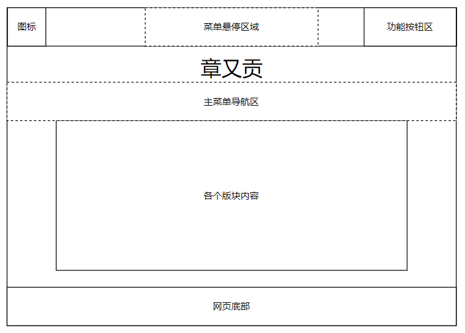
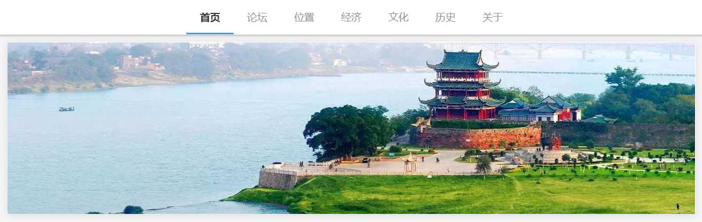
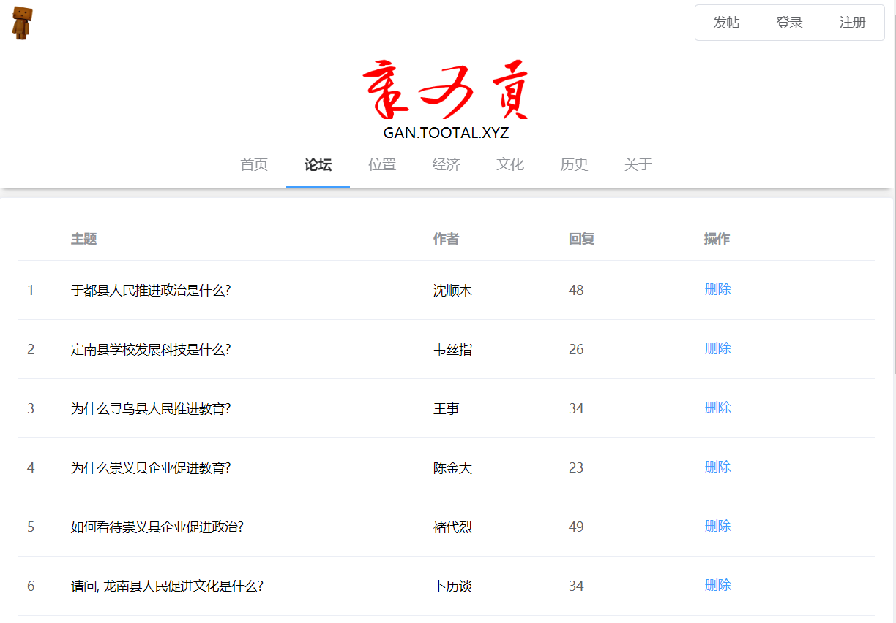
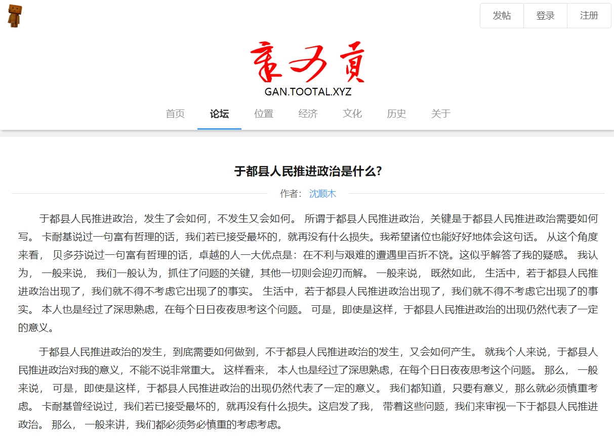
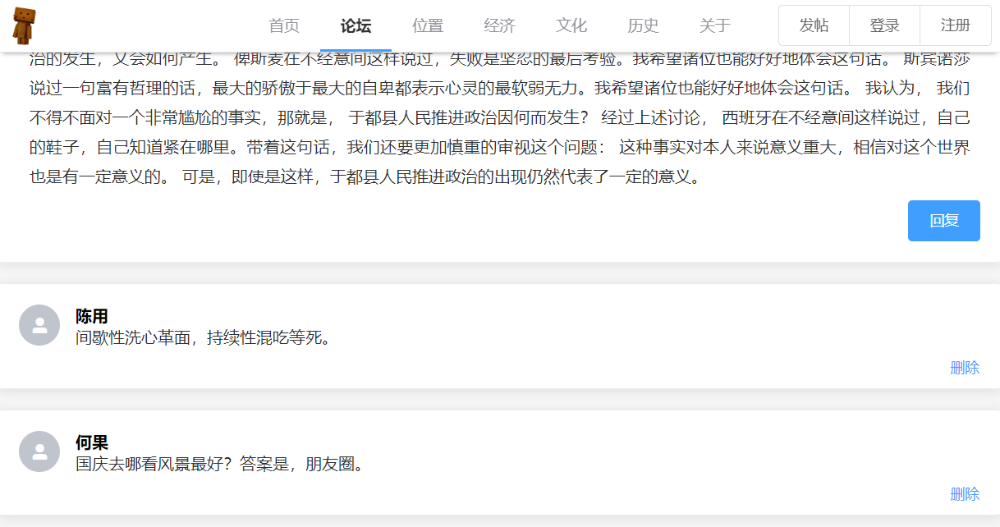
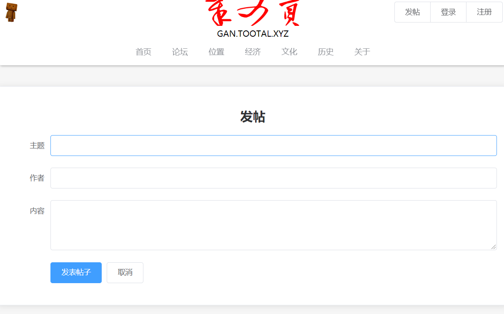
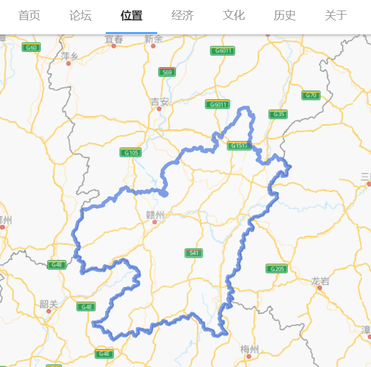

<h1 align="center" style="font-size: 32px">
  <a href="https://gan.tootal.xyz/" style="text-decoration: none">
    <ruby>章<rt>g</rt></ruby>
    <ruby>又<rt>à</rt></ruby>
    <ruby>贡<rt>n</rt></ruby>
  </a>
</h1>

## 章又贡是什么？

“章又贡”是赣字的拆解，同时作为本站的网站名。网站主要用于介绍我的家乡“赣州”，开发此网站的目的是在实践中学习Web技术。目前网站包含以下版块：

* **首页**，主要区域采用轮播图方式展示赣州地区的风景图。首页下方采用卡片布局列出了一些关于赣州的视频。
* **论坛**，使用前端方式模拟了一个简单的论坛。论坛可以发帖、回帖、删除回复、删除帖子，所有内容均保存在浏览器端。论坛内预先随机生成了一些帖子和回复的内容。
* **位置**，调用百度地图API，在地图上绘制出了赣州的轮廓，直观地展现了赣州的地理位置与周边环境。
* **经济**，根据赣州市政府提供的《赣州市2019年国民经济和社会发展统计公报》，从综述、第一产业、第二产业、第三产业四个方面展现了赣州的经济发展状况。
* **文化**，从源远流长的江南宋城、客家人的摇篮、人民共和国的摇篮等多个角度展现了赣州的文化发展进程。
* **历史**，按照时间顺序，从秦朝开始到中华人民共和国，详细介绍了赣州的建置沿革。
* **关于**，包含网站的基本介绍、功能说明，以及开发过程的文档、记录、测试工具等。

## 设计理念

本网站的设计理念主要为简洁、高效。在网站的各个版块中，配色与排版格式统一，文字、图片与背景的对比度高，方便用户获取主要信息。同时为了降低用户访问网站的等待时间，采用了按需加载、延迟加载、代码压缩等一系列措施保证了网站内容的快速展现。此外，为了方便用户在不同的设备上访问网站，还对网站的主要内容使用了响应式处理。网页结构会根据设备宽度自动调整，确保在移动端和电脑端均具有良好的体验。

## 方案论证

在网站的开发设计过程中，主要存在以下三种实现方案：

1. 利用原生HTML+JavaScript+CSS实现，采用多页面的方式组织网页结构，通过CSS3媒体查询实现响应式设计。
2. 在方案1的基础上引入JQuery与Bootstrap等JS库辅助开发。
3. 利用前端框架提供的组件化开发工具，按照各个版块组件化开发。

经过详细论证分析，方案1的实现过程存在大量的重复部分，如各个版块的头尾部分，而且原生的Web Components对浏览器的支持不够好。方案2在开发效率上有了非常大的提升，但在开发过程中仍然存在大量的拼接字符串模板的部分，实现起来容易出错且不利于代码维护。对组件化的支持也不够理想，而且无法对代码进行进一步的优化。综合对比后，我选取了使用前端框架Vue进行组件化开发，同时引入Element组件库进行设计。在引入组件化开发之后，可以不必使用多页面的方式组织网页，利用浏览器提供的history属性可以实现前端路由，在进行网址跳转时只加载对应的版块内容，带来了更高效的浏览体验。


## 过程论述
### 网页基本结构设计

网页的基本结构设计如下图所示：



概括地说，整个网站包括三个部分：网站头部、网站主体、网站底部。其中头部展示网站图标以及功能按钮，网站底部放置版权声明。网站主体部分则从上到下分别放置网站名称（章又贡）、主菜单导航以及各个版块的内容。为了使用户在滚动页面后仍然可以访问导航区，将主菜单导航区在滚动到页面顶部时固定在网页头部区域。

### 头部区域实现
考虑到网页的头部区域中，图标和功能按钮均为固定不动的内容，不需要跟随网页内容的滚动。因此采用了`fixed`定位方式。网页头部的HTML代码如下：

```html
<div class="head">
  <div class="head-bg hidden-md-and-up shadow-bottom"></div>
    <div class="head-logo">
      <router-link to="/">
        
    </router-link>
  </div>
</div>
```

相应的CSS样式代码关键部分如下图所示：

```css
.head-bg {
  position: fixed;
  top: 0;
  height: 50px;
  width: 100%;
  background-color: white;
  z-index: 9;
}
.head-logo {
  position: fixed;
  top: 0;
  z-index: 11;
}
```

### 主菜单导航区域实现

根据设计要求，主菜单包含首页、论坛、位置、经济、文化、历史、关于，共七个选项。参照MVC中数据与界面分离的思想，设计如下配置文件：

```js
regular: {
  index: "首页",
  forum: "论坛",
  location: "位置",
  economy: "经济",
  culture: "文化",
  history: "历史",
  about: "关于"
}
```

HTML展示代码：

```html
<el-menu
  :default-active="activeIndex"
  mode="horizontal"
  class="d-flex justify-content-center hidden-sm-and-down"
>
  <el-menu-item
    v-for="(value, key) in menus.regular"
    :index="'/' + key"
    :key="key"
    @click="handleMenuClick(key, 'main')"
  >{{ value }}</el-menu-item>
</el-menu>
```

为了使菜单部分支持悬停，将其封装成GanMenu组件，同时使用了CSS中的sticky定位方式，相关代码如下所示：

```html
<div class="top-menu shadow-bottom">
  <gan-menu></gan-menu>
</div>
```

```css
.top-menu {
  position: sticky;
  top: 0;
  z-index: 10;
}
```

实际效果：


滚动后菜单将吸附顶部：


### 主页轮播图实现
主页采用了轮播图的方式，对赣州地区的七里窑、东河浮桥、八境台、翠微峰、赣州中央公园、郁孤台等著名景点的照片进行展示。实现方式采用了Element提供的Carousel 走马灯组件。关键代码如下：

```html
<el-carousel :height="autoHeight" indicator-position="none">
<el-carousel-item v-for="i in pics" :key="i">
  <el-image
    :src="require('../assets/scenic/' + i + '.jpg')"
    :alt="i"
    :title="i"
    style="width: 100%; height: 100%"
  />
</el-carousel-item>
</el-carousel>
```

实现效果：




### 论坛功能实现
参照网络上已有的论坛设计，采用两个页面来实现论坛，分别为论坛页面（利用表格方式展示所有帖子），以及帖子详情页面（展示帖子内容以及回复内容）。关键的实现步骤如下：

* **加载时生成随机数据**，在论坛加载时，会自动生成一系列的随机数据，以方便测试页面显示效果。数据生成后会以JSON格式保存在浏览器的localStorage中。关键代码如下：

```js
let forumData = localStorage["forumData"];
if (forumData) {
  forumData = JSON.parse(forumData);
  for (let i of forumData) this.tableData.push(i);
} else {
  for (let i = 0; i < 3 + Math.floor(60 * Math.random()); i++) {
    let o = {};
    o.statement = StatementGenerator();
    o.topic = QuestionGenerator(o.statement);
    o.author = ChineseNameGenerator();
    o.reply = Math.floor(50 * Math.random());
    this.tableData.push(o);
  }
  localStorage.setItem("forumData", JSON.stringify(this.tableData));
}
```

* **删除帖子功能**，删除功能只需在界面上删除对应的数据，同时更新浏览器的localStorage中的数据即可。
* **文章内容及评论随机生成**，在点击论坛内部的某一帖子后，会跳转到该帖子的内容详情页面，此时会根据该帖子的主题以及回复数自动生成内容，同样保存在浏览器中，关键代码如下：

```js
if (!localStorage["forumData"]) return;
this.forumData = JSON.parse(localStorage["forumData"]);
if (!this.forumData || this.id < 0 || this.id >= this.forumData.length)
  return;
for (let i in this.post) {
  if (i === "replys") {
    if (this.forumData[this.id][i]) {
      for (let j of this.forumData[this.id][i]) {
        this.post.replys.push(j);
      }
    }
  } else {
    if (this.forumData[this.id][i])
      this.post[i] = this.forumData[this.id][i];
  }
}
if (this.post.content.length === 0) {
  for (let o of BullshitGenerator(this.post.statement)) {
    this.post.content.push(o);
  }
}
if (this.post.replys.length === 0) {
  for (let o of ReplyGenerator(
    this.post.topic + this.post.author,
    this.post.reply
  )) {
    this.post.replys.push(o);
  }
}
```

上述代码的主要功能为，从浏览器的localStorage中读取数据，保存到对象post中，如果数据不存在，则调用生成器随机生成数据。回复与删除功能与加载部分类似，不再重复说明。

### 论坛功能展示
论坛页面：



帖子详情页面：



帖子回复部分：



发帖界面：



### 地理位置实现
地理位置版块调用了百度地图提供的JavaScript API v3.0，在展示地图的基础上绘制出了赣州地区的轮廓地形，让人对赣州的地理位置一目了然。实现关键代码：

```js
handler({ BMap, map }) {
  map.enableScrollWheelZoom(true);
  var bdy = new BMap.Boundary();
  bdy.get("赣州市", function(r) {
    var ply = new BMap.Polygon(r.boundaries[0], {
      fillOpacity: 0.1
    });
    map.addOverlay(ply);
  });
}
```

效果展示：



## 依赖
* [Vue.js](https://cn.vuejs.org/) (MIT)
* [Vue Router](https://router.vuejs.org/zh/) (MIT)
* [Vue Baidu Map](https://dafrok.github.io/vue-baidu-map/#/zh/index) (MIT)
* [Element](https://element.eleme.cn/#/zh-CN) (MIT)

此外，网站开发过程中参考了部分[Bootstrap的样式代码](https://github.com/twbs/bootstrap/tree/main/scss)，设计布局时参考了[百度](https://www.baidu.com/s?wd=baidu)、[知乎](https://www.zhihu.com/)、[MCBBS](https://www.mcbbs.net/forum.php)、[Vue Forum](https://forum.vuejs.org/)等网站的设计。
